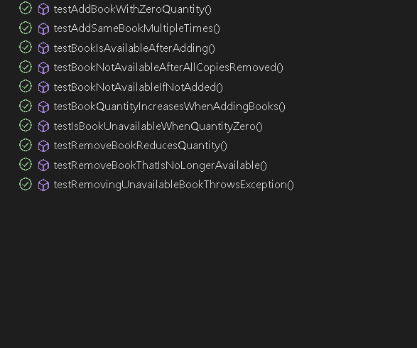

# Java Unit Tests

This project contains unit tests for the `BookStore` class using JUnit 5.

## Prerequisites

Before running the tests, ensure you have the following installed:

- Java Development Kit (JDK) 8 or higher
- Apache Maven

## Running the Tests

Follow these steps to run the unit tests:

1. **Clone the repository:**

   ```sh
   git clone https://github.com/tom-wasi/TAU_2024.git
   cd TAU_unittest/java-unittests
   mvn test
   ```

